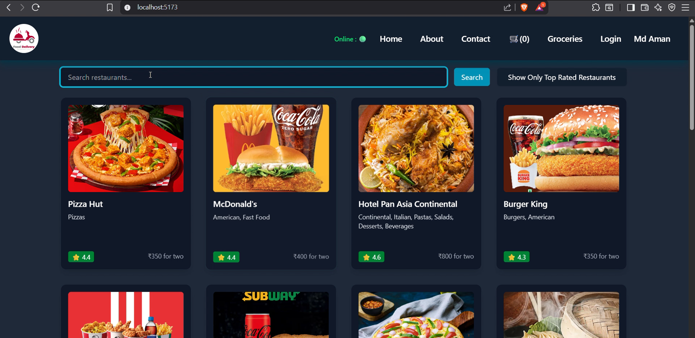

# 🍽️ FoodVilla

A Swiggy-inspired modern food ordering web app built with **React.js**, **Redux Toolkit**, **Tailwind CSS**, and **live API integration**. This is my personal project to learn and build scalable frontend applications with real-world features and architecture.

## 🎬 Demo Video (Swiggy API is having issues. Click the Thumbnail to play)

## 🔥 Features

- ⚛️ Built with **React.js**
- 🛒 Global state management using **Redux Toolkit**
- ⚡ Optimized performance with **dynamic routing**, **lazy loading**, and **code splitting**
- 🧩 Reusable & modular component architecture
- 🧭 **React Router DOM** for seamless navigation
- 🎨 **Tailwind CSS** for responsive & clean UI
- 🔗 API-driven restaurant & menu data
- 💚 Developer-friendly folder structure

